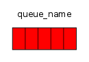

# Кириш
RabbitMQ бу - хабарлар маклери. Маъноси шуки, у тайёрловчилардан хабарни олади ва уларни истеъмолчиларга етказади. Ўртада сиз берган қоидага асосан у хабарларни маршрутлаш, буфферлаш ва мажбурлашларни олиб боради.

RabbitMQ ва хабарлашиш умумий ҳолда қуйидаги терминларни ишлатади.

•	Producing – бу жўнатишдан бошқа ҳеч нарса эмас. Хабарларни жўнатувчи дастур бу producer(яратувчи). Биз уни кейинчалик қуйидаги кўринишда чизамиз "P":

Queue(навбат) бу почта қутиси номи. У RabbitMQ ичида яшайди. Хабарлар RabbitMQ  ва сизнинг дастурларингиз орқали ўтсада улар фақат queue (навбат) ичида сақланади. Queue  ҳеч қандай чегараланишларга эга эмас. У хабарларни сақлашда сиз хоҳлаган катталикдаги чексиз буфферга ўхшайди. Кўп producer лар битта навбатдан чиқувчи хабарларни жўнатишлари ва мана шу битта навбатдан жуда кўп consumer(истеъмолчи) лар хабарларни қабул қилиб олишга уриниб кўришлари мумкин. Queue ни қуйидаги кўринишда чизамиз ва устида унинг номини ҳам келтирамиз:

Consuming (истеъмол қилиш) бу маъно жиҳатдан қабул қилиш билан ўхшашликка эга. Consumer бу программа бўлиб, одатда ушбу программалар хабарни олиш учун кутишади. Бизнинг чизмамизда у "C" каби тасвирланган:

