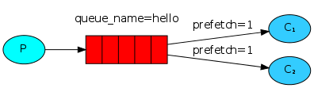

#Навбатлар билан ишлаш
##(Go RabbitMQ клиентни қўллаган ҳолда)
##Олд келишувлар
Ушбу қўлланма localhost да стандарт порт(5672)да ўрнатилган ва ишга туширилган RabbitMQ ни қўллайди.  
Сиз турли хостларни, портларни ёки ҳуқуқ параметрларини ўзгартирган вазиятингизда, боғланиш созлашлари тўғриланиши талаб этилади. 
##Ёрдамни қаердан олиш керак?
Агар сиз ушбу қўлланма бўйича боришга ҳавотирланаётган бўлсангиз сиз почталар рўйҳатидан фойдаланиб [биз билан](https://groups.google.com/forum/#%21forum/rabbitmq-users) боғланишингиз мумкин.


[Биринчи қўлланмада](chapter1.md) биз номланган навбат ёрдамида хабар жўнатувчи ва қабул қилувчи дастур ёздик. Ушбу бўлимда эса биз оғир ишларни кўпгина ишчиларга тақсимлашда ишлатиладиган Work Queue (ишчи навбат) яратамиз.

Work Queue нинг мақсади кўп ресурс ейдиган масалани дарров ҳал қилишдан қочиш ва уни кутиш режимига қўйишдир. Унинг ўрнига биз масалани ҳал этишни бироз кейинроққа режалаштирамиз. Биз масалани хабар кўринишида фомаллаштирамиз ва уни навбатга жўнатамиз. Орқа фонда ишлаб турган ишчи процесс муҳитнинг “tasks” бўлимида пайдо бўлади ва охир оқибат масалани ҳал қилади. Кўп ишчиларни ишга туширган вақтингизда масалалар улар орасида тақсимланади.

Бу концепция асосан веб-дастурларнинг мураккаб масалаларни HTTP сўров ойнаси орқали қисқа вақт ичида ҳал қилиши керак вақтида ас қотади.

#Қолип

Қўлланманинг аввалги қисмида биз "Hello World!" матнидан иборат бўлган хабарни юборгандик. Энди биз мураккаб масалалардан иборат бўлган сатрларни жўнатамиз. Биз расм ўлчамини ўзгартириш pdf файлни яратиш каби аниқ бир масалани олмаймиз, шу сабабли келинг time.Sleep функциясидан фойдаланиб биз ўзимизни банддай тутамиз. Биз сатрдаги нуқталар сонини мураккаблик даражаси деб оламиз. Ҳар бир нуқта ишнинг бир секундлик ҳажмига тенг дея қабул қиламиз. Масалан, айтайлик Hello... матн уч секунд вақт талаб қилишини билдиради.

Хабарларни командалар сатридан жўнатиш имконини яратиш учун биз бундан олдинги мисолдаги send.go га бироз ўзгартириш киритамиз. Ушбу дастур масалаларни бизнинг work queue (иш навбати) режасига қўшади.  Шу сабабли биз унга new_task.go дея ном берамиз:
```
body := bodyFrom(os.Args)
err = ch.Publish(
  "",           // exchange
  q.Name,       // routing key
  false,        // mandatory
  false,
  amqp.Publishing {
    DeliveryMode: amqp.Persistent,
    ContentType:  "text/plain",
    Body:         []byte(body),
  })
failOnError(err, "Failed to publish a message")
log.Printf(" [x] Sent %s", body)
```

Бизнинг receive.go  скриптимиз ҳам бир оз ўзгаришларни талаб этади: у хабардаги ҳар бир нуқта учун иккинчи ишни бекор қилиб туради. У хабарларни навбатдан олади ва бажаради, шу сабабли келинг уни worker.go деб атаймиз:
```
msgs, err := ch.Consume(
  q.Name, // queue
  "",     // consumer
  false,  // auto-ack
  false,  // exclusive
  false,  // no-local
  false,  // no-wait
  nil,    // args
)
failOnError(err, "Failed to register a consumer")

forever := make(chan bool)

go func() {
  for d := range msgs {
    log.Printf("Received a message: %s", d.Body)
    d.Ack(false)
    dot_count := bytes.Count(d.Body, []byte("."))
    t := time.Duration(dot_count)
    time.Sleep(t * time.Second)
    log.Printf("Done")
  }
}()

log.Printf(" [*] Waiting for messages. To exit press CTRL+C")
<-forever
```
Эътибор беринг бизнинг холбаки масаламиз ишлаш вақтини симуляция қилаябди.
Уларни биринчи қўлланмадагидек ишга туширамиз:
```
shell1$ go run worker.go
shell2$ go run new_task.go
```
#Айланма диспетчерлик
Task Queue нинг афзалликларидан бири шуки, унинг ишни онсонлик билан параллеллаштира олишидир. Агар биз қураётган ишчи орқада қолаётган бўлса биз кўпроқ ишчиларни қўшамиз ва онсонлик билан масштаблаш амалга ошади.

Биринчи, келинг иккита worker.go скриптни бир вақтда ишга тушириб кўрамиз Улар иккиси ҳам хабарни олишади, лекин айнан қандай? Келинг кўрамиз.

Сиз учта командалар сатрини очишингиз керак. Иккитасида worker.go скриптни ишга туширамиз. Ушбу командалар сатрида бизнинг иккита қабул қилувчиларимиз - C1 ва C2 лар бўлади.
```
shell1$ go run worker.go
 [*] Waiting for messages. To exit press CTRL+C
shell2$ go run worker.go
 [*] Waiting for messages. To exit press CTRL+C
```
Командалар сатрининг учтасидан бирида эса биз янги масалаларни юборамиз. Сиз қабул қилувчиларни ишга туширишингиз билан бир қанча хабарларни жўнатишингиз мумкин:
```
shell3$ go run new_task.go First message.
shell3$ go run new_task.go Second message..
shell3$ go run new_task.go Third message...
shell3$ go run new_task.go Fourth message....
shell3$ go run new_task.go Fifth message.....
```
Келинг кўрайликчи бизни ишчиларимизга нималар тақсимланибди:
```
shell1$ go run worker.go
 [*] Waiting for messages. To exit press CTRL+C
 [x] Received 'First message.'
 [x] Received 'Third message...'
 [x] Received 'Fifth message.....'
shell2$ go run worker.go
 [*] Waiting for messages. To exit press CTRL+C
 [x] Received 'Second message..'
 [x] Received 'Fourth message....'
```
Ўзгаришсиз ҳолатда RabbitMQ ҳар бир хабарни кейинги қабул қилувчиларга кетма-кет жўнатади. Ўртача ҳисоблаганда ҳар бир қабул қилувчи бир хил сондаги хабарни олади. Хабарларни тақсимланишининг бундай усули айланма дея аталади. Буни учта ёки ундан ортиқ worker лар билан ишлатиблўринг.

#Тасдиқловчи хабарлар
Масалани бажариш бир қанча секундларни олиши мукин. Сиз агарда қабул қилувчилардан бири узун вақт давомида ишлаб ишини охиригача қилмасдан ўлиб қолса нима бўлади деб савол беришингиз мумкин. Бизнинг хозирги кодимизда RabbitMQ бир бор хабарларни буюртмачига тарқатиб бўлиб хотирадан дарров ўчиб кетади. Ушбу ҳолатда агар сиз ишчини ўлдирсангиз у ҳолда биз шу жараёндаги хабарни йўқотган бўлардик. Биз яна шу ишчига юборилган аммо ҳали ҳам ишланмаган хабарларни ҳам йўқотамиз.

Аммо биз ҳеч қандай топшириқ йўқолиб қолмаслигини хоҳлаймиз. Агар ишчи ўлса, биз масала бошқа ишчига етказилиб берилишини.

Масалани ҳеч қачон йўқолиб қолмаётганини билиш учун RabbitMQ тасдиқловчи хабарларни ишлатади. Тасдиқловчи бу – қабул қилувчидан RabbitMQ га жўнатилган жорий хабарнинг қабул қилганлигини, жараёнлаштирилганлигини ва энди RabbitMQ уни ўчира олишини хабарини ортга жўнатиши.

Агар қабул қилувчи ортга жавоб қайтармасдан ўлиб кетса, RabbitMQ жараён охирига қадар етказилмади деб тушуниб уни бошқа қабул қилувчига жўнатади. Шу туфайли сиз ишонишингиз мумкинки сизни ҳеч қандай хабарингиз йўқолиб қолмайди, ҳатто ишчилар ўлиб қолсада.

Яна ҳабарни кутиш вақтлари ҳам бор. RabbitMQ ишчи билан боғланишни йўқотса хабарни бошқа ишчига тақсимлайди. Бундай йўл ҳабарлашиш узоқ вақтга чўзилса ас қотади.

Хабарни тасдиқлаш ўзгаришсиз ҳолатда ўчирилган. Бу вақтда уларни қўллаш учун // auto-ack  опциясининг false сини ўзгартириш ва тасдиқ хоссасини ишчи орқали d.Ack(false) жўнатилади. Буни биз бир масала билан амалга оширгандик.

```
msgs, err := ch.Consume(
  q.Name, // queue
  "",     // consumer
  false,  // auto-ack
  false,  // exclusive
  false,  // no-local
  false,  // no-wait
  nil,    // args
)
failOnError(err, "Failed to register a consumer")

forever := make(chan bool)

go func() {
  for d := range msgs {
    log.Printf("Received a message: %s", d.Body)
    d.Ack(false)
    dot_count := bytes.Count(d.Body, []byte("."))
    t := time.Duration(dot_count)
    time.Sleep(t * time.Second)
    log.Printf("Done")
  }
}()

log.Printf(" [*] Waiting for messages. To exit press CTRL+C")
<-forever
```
Ушбу кодни қўллаб биз шунга аниқ амин бўламизки, ҳабарни қайта ишлаш вақтида сиз ишчини CTRL+C орқали ўлдирганингизда ҳам ҳеч нарса йўқолиб қолмайди. Ишчи ўлганидан кейин барча тасдиқланмаган ҳабарлар бошқатдан етказилади. 

##Тасдиқни унутдик
Бу тасдиқлаш жараёнидаги тарқалган хатолик. Бу содда хатолик, аммо натижаси жиддий муаммолар келтириши мумкин. Ҳабарлар сизни мижозларингиз узилганида ҳам етказилади (тасодифий етказилиш каби), аммо RabbitMQ тасдиқланмаган ҳабарларни қўйвора олмаганлиги боис у кўпдан-кўп хотирани ейишни бошлайди.

Бундай хатоликларни ушлаш учун rabbitmqctl дан фойдаланиб messages_unacknowledged  майдонини чоп этиш керак:
```
$ sudo rabbitmqctl list_queues name messages_ready messagesқ_unacknowledged
Listing queues ...
hello    0       0
...done.
```
#Ҳабар давомийлиги
Биз қабул қилувчи ўлган вақтда ҳам масала йўқолиб қолмаслигини таъминлашни ўрганиб олдик. Аммо бизнинг масалалар аввалгидай йўқолиб қолиши мумкин агарда RabbitMQ  сервер тўхтаб қолса.

RabbitMQ иши тўхтатилса ёки қотиб қолса токи сиз ундай қилмаслик ҳақида айтмагунингизча у навбатлар ва ҳабарларни ёддан чиқаради. Ҳабарларни йўқолиб қолмаслигига аниқ ишонч хосил қилиш учун биздан навбат ва ҳабар иккаласини ҳам давомийлигини белгилаб қўйиш талаб этилади.

Биринчидан биз RabbitMQ ҳеч қачон бизнинг ҳабарларни йўқотмаслигига ишонч хосил қиламиз. Буни амалга ошириш учун уни durable (давомий) каби эълон қилишимиз керак:
```
q, err := ch.QueueDeclare(
  "hello",      // name
  true,         // durable
  false,        // delete when unused
  false,        // exclusive
  false,        // no-wait
  nil,          // arguments
)
failOnError(err, "Failed to declare a queue")
```
Ушбу команда тўғри бўлсада юқоридаги созлашларга нисбатаг у ўз-ўзидан ишлаб кетавермайди. Бунга сабаб биз hello номли навбатни давомий эмас тарзда аниқлаб қўйганмиз. RabbitMQ мавжуд навбатларни турли хил созлашлар билан ишлатилишига йўл қўймайди ва бундай қилмоқчи бўлган дастурларга хатолик беради. Амма буни тез айланибўтиш имкони мавжуд келинг навбатни башқа ном билан масалан task_queue каби номлаймиз:

```
q, err := ch.QueueDeclare(
  "task_queue", // name
  true,         // durable
  false,        // delete when unused
  false,        // exclusive
  false,        // no-wait
  nil,          // arguments
)
failOnError(err, "Failed to declare a queue")
```
Ушбу давомийлик коди икки тарафга яъни producer ва consumer лар кодларида қўлланилиши керак.

Айни дамда бизнинг ишончимиз комилки task_queue навбат RabbitMQ қайта юкланган тақдирда ҳам йўқолиб қолмайди. Энди биз amqp.Publishing қабул қиладиган amqp.Persistent опциясини қўллаб ҳабарларни турғун кўринишда белгилашимиз керак.

```
err = ch.Publish(
  "",           // exchange
  q.Name,       // routing key
  false,        // mandatory
  false,
  amqp.Publishing {
    DeliveryMode: amqp.Persistent,
    ContentType:  "text/plain",
    Body:         []byte(body),
  })
```
##Ҳабар турғунлиги ҳақида изоҳ
Ҳабарни турғун кўринишида белгилаб қўйиш уни тўлиқ йўқолмаслигини таъминлашига кафолат бермайди. У RabbitMQ га ҳабарларни дискка сақлаш ҳақида айтган бўлсада шундай вақт оралиғи мавжудки RabbitMQ ҳабарларни олган бўлади лекин уларни ҳали ҳамон дискка сақламаган бўлади. Яна RabbitMQ ҳамма хабарларни fsync(2) қилмаслиги ва ҳақиқатда дискда сақлаш ўрнига уларни фақат кешда сақлаган бўлиши мумкин. Турғунлик кафолати кучли эмас, бироқ бизни кичик навбатли масаламиз учун бу етарли. Агар сиз янада кучли кафолатни хоҳласангиз у ҳолда сиз publisher confirms (таҳрирловчи тасдиқлайди) ни қўллашингиз мумкин.

#Ҳаққоний жўнатиш

Эҳтимол сиз эътибор бергандирсиз, жўнатиш биз хоҳлагандай ишламаябди. Масалан, иккита ишчи ҳолатида қачонки тоқ ҳабарлар оғирроқ ва жуфт ҳабарлар енгилроқ бўлганида битта ишчи доим банд ва иккинчи ишчи ихтиёрий ишларни бажаради. RabbitMQ эса бундан ҳабарсиз ва ҳали ҳамон ҳабарларни бир маромда жўнатади.

Бу шунданки, RabbitMQ ҳабарларни навбатларга ҳабар келганида жўнатиб юбораябди. У қўлловчининг тасдиқланмаган ҳабарлар сонига қарамайди. У фақат кўр-кўрона ҳар бир n-ҳабарни n-истъемолчига юборади.



Буни олдини олиш учун биз prefetch ҳисоблагичига 1 қиймат бериб қўсак бўлади. Бу RabbitMQ ни ишчига бир вақтда бирдан ортиқ иш бермасликка ундайди. Ёки бошқача қилиб айтганда, бу қиймат RabbitMQ га ишчидан битта ишини бажариб бўлганлиги ҳақидаги ҳабарини олмагунча ишчига янги иш бермаслик кераклигини айтади. Буни ўрнига RabbitMQ хозирда иш билан банд бўлмаган бошқа ишчига иш жўнатади.
```
err = ch.Qos(
  1,     // prefetch count
  0,     // prefetch size
  false, // global
)
failOnError(err, "Failed to set QoS")
```
#Навбат ўлчами ҳақида изоҳ
Агар барча ишчилар банд бўлса сизни навбатингиз тўлиб кетиши мумкин. Сиз уларни қандай эканлигини кузатиб туришни ва балким кўпроқ ишчиларни қўшиш ёки бошқа стратегияни хоҳлашингиз мумкин.

#Ҳаммасини биргаликда қўйсак

Бизнинг янги new_task.go нинг коди:

