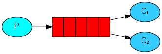

#Навбатлар билан ишлаш
##(Go RabbitMQ клиентни қўллаган ҳолда)
##Олд келишувлар
Ушбу қўлланма localhost да стандарт порт(5672)да ўрнатилган ва ишга туширилган RabbitMQ ни қўллайди.  
Сиз турли хостларни, портларни ёки ҳуқуқ параметрларини ўзгартирган вазиятингизда, боғланиш созлашлари тўғриланиши талаб этилади. 
##Ёрдамни қаердан олиш керак?
Агар сиз ушбу қўлланма бўйича боришга ҳавотирланаётган бўлсангиз сиз почталар рўйҳатидан фойдаланиб [биз билан](https://groups.google.com/forum/#%21forum/rabbitmq-users) боғланишингиз мумкин.



[Биринчи қўлланмада](chapter1.md) биз номланган навбат ёрдамида хабар жўнатувчи ва қабул қилувчи дастур ёздик. Ушбу бўлимда эса биз оғир ишларни кўпгина ишчиларга тақсимлашда ишлатиладиган Work Queue (ишчи навбат) яратамиз.

Work Queue нинг мақсади кўп ресурс ейдиган масалани дарров ҳал қилишдан қочиш ва уни кутиш режимига қўйишдир. Унинг ўрнига биз масалани ҳал этишни бироз кейинроққа режалаштирамиз. Биз масалани хабар кўринишида фомаллаштирамиз ва уни навбатга жўнатамиз. Орқа фонда ишлаб турган ишчи процесс муҳитнинг “tasks” бўлимида пайдо бўлади ва охир оқибат масалани ҳал қилади. Кўп ишчиларни ишга туширган вақтингизда масалалар улар орасида тақсимланади.

Бу концепция асосан веб-дастурларнинг мураккаб масалаларни HTTP сўров ойнаси орқали қисқа вақт ичида ҳал қилиши керак вақтида ас қотади.

#Қолип

Қўлланманинг аввалги қисмида биз "Hello World!" матнидан иборат бўлган хабарни юборгандик. Энди биз мураккаб масалалардан иборат бўлган сатрларни жўнатамиз. Биз расм ўлчамини ўзгартириш pdf файлни яратиш каби аниқ бир масалани олмаймиз, шу сабабли келинг time.Sleep функциясидан фойдаланиб биз ўзимизни банддай тутамиз. Биз сатрдаги нуқталар сонини мураккаблик даражаси деб оламиз. Ҳар бир нуқта ишнинг бир секундлик ҳажмига тенг дея қабул қиламиз. Масалан, айтайлик Hello... матн уч секунд вақт талаб қилишини билдиради.

Хабарларни командалар сатридан жўнатиш имконини яратиш учун биз бундан олдинги мисолдаги send.go га бироз ўзгартириш киритамиз. Ушбу дастур масалаларни бизнинг work queue (иш навбати) режасига қўшади.  Шу сабабли биз унга new_task.go дея ном берамиз:
```
body := bodyFrom(os.Args)
err = ch.Publish(
  "",           // exchange
  q.Name,       // routing key
  false,        // mandatory
  false,
  amqp.Publishing {
    DeliveryMode: amqp.Persistent,
    ContentType:  "text/plain",
    Body:         []byte(body),
  })
failOnError(err, "Failed to publish a message")
log.Printf(" [x] Sent %s", body)
```

Бизнинг receive.go  скриптимиз ҳам бир оз ўзгаришларни талаб этади: у хабардаги ҳар бир нуқта учун иккинчи ишни бекор қилиб туради. У хабарларни навбатдан олади ва бажаради, шу сабабли келинг уни worker.go деб атаймиз:
```
msgs, err := ch.Consume(
  q.Name, // queue
  "",     // consumer
  false,  // auto-ack
  false,  // exclusive
  false,  // no-local
  false,  // no-wait
  nil,    // args
)
failOnError(err, "Failed to register a consumer")

forever := make(chan bool)

go func() {
  for d := range msgs {
    log.Printf("Received a message: %s", d.Body)
    d.Ack(false)
    dot_count := bytes.Count(d.Body, []byte("."))
    t := time.Duration(dot_count)
    time.Sleep(t * time.Second)
    log.Printf("Done")
  }
}()

log.Printf(" [*] Waiting for messages. To exit press CTRL+C")
<-forever
```
Эътибор беринг бизнинг холбаки масаламиз ишлаш вақтини симуляция қилаябди.
Уларни биринчи қўлланмадагидек ишга туширамиз:
```
shell1$ go run worker.go
shell2$ go run new_task.go
```
#Айланма диспетчерлик
Task Queue нинг афзалликларидан бири шуки, унинг ишни онсонлик билан параллеллаштира олишидир. Агар биз қураётган ишчи орқада қолаётган бўлса биз кўпроқ ишчиларни қўшамиз ва онсонлик билан масштаблаш амалга ошади.

Биринчи, келинг иккита worker.go скриптни бир вақтда ишга тушириб кўрамиз Улар иккиси ҳам хабарни олишади, лекин айнан қандай? Келинг кўрамиз.

Сиз учта командалар сатрини очишингиз керак. Иккитасида worker.go скриптни ишга туширамиз. Ушбу командалар сатрида бизнинг иккита қабул қилувчиларимиз - C1 ва C2 лар бўлади.
```
shell1$ go run worker.go
 [*] Waiting for messages. To exit press CTRL+C
shell2$ go run worker.go
 [*] Waiting for messages. To exit press CTRL+C
```
Командалар сатрининг учтасидан бирида эса биз янги масалаларни юборамиз. Сиз қабул қилувчиларни ишга туширишингиз билан бир қанча хабарларни жўнатишингиз мумкин:
```
shell3$ go run new_task.go First message.
shell3$ go run new_task.go Second message..
shell3$ go run new_task.go Third message...
shell3$ go run new_task.go Fourth message....
shell3$ go run new_task.go Fifth message.....
```
Келинг кўрайликчи бизни ишчиларимизга нималар тақсимланибди:
```
shell1$ go run worker.go
 [*] Waiting for messages. To exit press CTRL+C
 [x] Received 'First message.'
 [x] Received 'Third message...'
 [x] Received 'Fifth message.....'
shell2$ go run worker.go
 [*] Waiting for messages. To exit press CTRL+C
 [x] Received 'Second message..'
 [x] Received 'Fourth message....'
```
Ўзгаришсиз ҳолатда RabbitMQ ҳар бир хабарни кейинги қабул қилувчиларга кетма-кет жўнатади. Ўртача ҳисоблаганда ҳар бир қабул қилувчи бир хил сондаги хабарни олади. Хабарларни тақсимланишининг бундай усули айланма дея аталади. Буни учта ёки ундан ортиқ worker лар билан ишлатиблўринг.

#Тасдиқловчи хабарлар
Масалани бажариш бир қанча секундларни олиши мукин. Сиз агарда қабул қилувчилардан бири узун вақт давомида ишлаб ишини охиригача қилмасдан ўлиб қолса нима бўлади деб савол беришингиз мумкин. Бизнинг хозирги кодимизда RabbitMQ бир бор хабарларни буюртмачига тарқатиб бўлиб хотирадан дарров ўчиб кетади. Ушбу ҳолатда агар сиз ишчини ўлдирсангиз у ҳолда биз шу жараёндаги хабарни йўқотган бўлардик. Биз яна шу ишчига юборилган аммо ҳали ҳам ишланмаган хабарларни ҳам йўқотамиз.

Аммо биз ҳеч қандай топшириқ йўқолиб қолмаслигини хоҳлаймиз. Агар ишчи ўлса, биз масала бошқа ишчига етказилиб берилишини.

Масалани ҳеч қачон йўқолиб қолмаётганини билиш учун RabbitMQ тасдиқловчи хабарларни ишлатади. Тасдиқловчи бу – қабул қилувчидан RabbitMQ га жўнатилган жорий хабарнинг қабул қилганлигини, жараёнлаштирилганлигини ва энди RabbitMQ уни ўчира олишини хабарини ортга жўнатиши.
