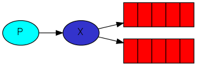

#Publish (Нашр)/Subscribe (Обуна)
##(Go RabbitMQ клиентни қўллаган ҳолда)
Аввалги қўлланмада биз иш навбатни яратдик. Иш навбатининг пировардида ҳар бир масала аниқ битта ишчига етказилганди. Ушбу бу бўлимда биз умуман бошқача йўл тутамиз – биз ҳабарни бир қанча истъемолчиларга етказамиз. Ушбу модель "publish(нашр)/subscribe(обуна)" дея номланган.

Тасаввур хосил қилиш учун биз қайдлаш содда тизимини қурамиз. У иккита дастурдан ташкил топган бўлади – биринчиси ҳабарлар журналини нашр қилади иккинчиси уларни қабул қилиб чоп этади.

Бизнинг қайдлаш тизимимиздаги ҳар бир ишга тушган қабул қилувчи дастуримиз ҳабарларни қабул қилади. Шу тарзда биз битта қабул қилувчини ишга тушириб, қайдни дискка йўналтиришимиз ва бир вақтда биз бошқа қабул қилувчини ҳам ишга туширамиз ва қайдларни экранда кўрамиз.

Мазмунан, нашр қилинган қайд ҳабарлар ҳар бир қабул қилувчиларга трансляция қилинади.

#Алмашинувлар

Қўлланманинг аввалги қисмларида биз ҳабарларни навбатдан юбориб навбатдан қабул қилгандик. Rabbit да хабарлашишнинг тўлиқ модели билан танишиш вақти етиб келди.

Келинг аввалги қўлланмаларда нималар билан танишганимизни тез кўриб чиқайлик:

•	producer (юборувчи) бу – дастур фойдаланувчиси бўлиб, у ҳабарларни юборади.
•	queue (навбат) бу – хабарларни сақловчи буффер.
•	consumer (қабул қилувчи) бу – дастур фойдаланувчиси бўлиб, ҳабарларни қабул қилади.

RabbitMQ нинг ҳабарлашиш моделининг туб ўзак ғоясида – жўнатувчи ҳеч қачон ҳеч қанақа ҳабарларни навбатга жўнатмайди. Аслини олганда, жуда кўп ҳолларда юборувчи ҳабарларни қайси навбатга тақсимланганлигини билавермайди.

Буни ўрнига producer ҳабарларни exchange (алмашиниш)га юбориши мумкин. Exchange  бу – жуда содда нарса. У бир томондан producer лардан ҳабарни олса иккинчи томондан  уларни навбатга тиқади. Exchange олган ҳабарини аниқ нима қилиши кераклигини билиши керак. У аниқ бир навбатга қўшилиши керакми? У кўп навбатларга қўшилиши керакми? Ёки ушбу олинган ташлаб юбориладими. Булар учун қоидалар exchange type  орқали аниқланган.



Бир қанча exchange турлари мавжуд: direct (узлуксиз), topic(мавзули), headers(сарлавҳалар) ва fanout(елпиғич каби тармоқланиш). Биз улардан биттаси охиргиси fanout га эътиборимизни қаратамиз. Келинг exchange ни ушбу турда яратамиз ва уни logs  деб номлаймиз:

```
err = ch.ExchangeDeclare(
  "logs",   // name
  "fanout", // type
  true,     // durable
  false,    // auto-deleted
  false,    // internal
  false,    // no-wait
  nil,      // arguments
)
```
fanout exchange бу – жуда оддий. Номидан билган бўлсангиз керак, у ўзи билган барча навбатларга тегишли ҳабарларни фақат трансляция қилади. Ва бу бизнинг қайдловчимиз учун айнан керак бўлган нарса.

#Exchange ларни рўйҳатлаш

