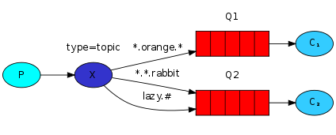

#Мавзулар
##(Go RabbitMQ клиентини қўллаган ҳолда)

Аввалги қўлланмада биз бизнинг қайдлаш тизимимизни мукаммаллаштиргандик. Фақат бошланғич содда трансляцияни амалга ошира оладиган fanout exchange ўрнига биз direct exchange ни қўллаб уни қайдларни саралаб қабул қилишгача қайта ишлагандик.

Биз direct exchange  ёрдамида уни мукаммаллаштирган бўлсакда, у ҳам камчиликга эга бўлиб,  у бир қанча шартлар асосида маршрутлашни амалга ошира олмайди.

Бизнинг қайдлаш тизимимизда биз обуна бўлиш учун нафақат муҳимликка (severity), балки яна қайдларни тарқатувчи source (манба) га асосланишимиз ҳам мумкин. Сиз эҳтимол биларсиз ушбу концепция маршрутлашни муҳимлик (severity (info/warn/crit...)) ва объектга (facility (auth/cron/kern...)) асосланувчи unix ускунаси бўлмиш syslog дан олинган. 

Бу бизга анча мослашувчанликни беради. Биз 'cron' дан келаётган критик хатоларнигина ва яна 'kern' дан келаётган барча ҳабарларни эшитишни хоҳлашимиз мумкин.

Буни бизнинг қайдлаш тизимимизда амалга ошириш учун биз янада мукаммаллашган topic exchange (мавзули айирбошлаш) ни ўрганишимиз керак. 

#Мавзули айирбошлаш

Topic exchange га юборилган ҳабарлар routing_key лари ихтиёрий кўринишда эмас, балки бир-биридан нуқталар билан ажратилган сўзлардан иборат бўлиши керак. Сўзлар ихтиёрий бўлиши мумкин, бироқ одатда улар ҳабарларга боғлиқ бўлган баъзи муҳим нарсаларни белгилаб беради. Уларга мисол тариқасида қуйидагиларни олиш мумкин: "stock.usd.nyse", "nyse.vmw", "quick.orange.rabbit". Унда 255 байтгача сиз хоҳлаган кўринишдаги routing key бўлиши мумкин.

Binding key ҳам шу шаклда бўлиши керак. Topic exchange мантиғи direct exchange никига ўхшаш бўлиб, ҳабар аниқ routing key билан жўнатилиб, binding key га мос келадиган навбатларга тақсимланади. Бироқ binding key лар учун иккита хусусий ҳолат бор:

•	* (star(юлдузча)) фақат битта сўзни алмаштира олади.
•	# (hash(панжара)) 0 ёки ундан кўп сўзларни алмаштира олади.

Буни мисолларда тушунтириш онсонроқ:

Ушбу мисолда биз барча ҳайвонларни таърифловчи ҳабарларни жўнатмоқчимиз. Ҳабарлар учта сўзни (иккита нуқтали)ўзида мужассамлаштирган routing key билан жўнатилади. Routing key даги биринчи сўз speed (тезликни), иккинчиси colour (рангни) ва учинчиси species(турларни) англатади: "<speed>.<colour>.<species>".

Биз учта боғланишни яратдик: Q1 "*.orange.*" binding key билан боғланган, Q2 эса "*.*.rabbit" ва "lazy.#" лар билан боғланган.

Ушбу боғланишларни қуйидагича умумлаштириш мумкин:

